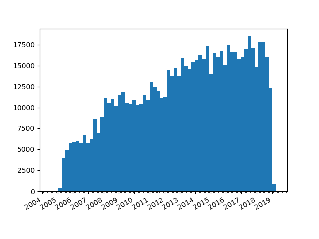
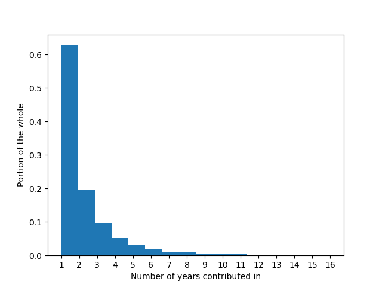

# MSR Study: Analyzing Contributor Patterns In the Mainline Linux Repository

Evan Peterson

## Study Description

For this lab, I chose to focus my analysis on identifying patterns and characteristics of the people that contribute to the Linux mainline repository. To accomplish this, I began by parsing the repo’s git history logs into a ~195MB minified JSON file using a Python script. The JSON file contains an object for each commit in the git history, each object containing a commit timestamp, author, and other extracted fields like “Signed-off-by,” “Reviewed-by,” etc.. During the parsing, timestamps were localized. Also, merge commits were excluded, so each commit in the final extracted data could be considered an original contribution. It should also be noted that email addresses were used as the unique identifier for a contributor.

To track the true author(s) of a commit, the extracted “Signed-off-by” field was used, rather than the author field, since the Linux repo uses that field as a record of the true author(s). This is because the author field can become polluted as the commit percolates up through layers of subsystem maintainers. The only issue is that sometimes subsystem maintainers are listed in a patch’s “Signed-off-by” field as a non-author sign-off, with no data in the commit message that differentiates between an author and non-author sign-off. I chose to include all sign-offs present in the data, despite the fact that some are associated with subsystem maintainers. This so as to not exclude any sign-offs for which those maintainers may have been an actual author on the patch.

## Highlights of Results

At the time the mainline repository was cloned for this analysis (2/15/2019), it contained 752,181 non-merge commits and 23,825 distinct contributors. First off I was interested to know if the Linux kernel followed the 80/20 rule. Are 20% of the contributors responsible for 80% of the contributions? I discovered that the top 71 (0.30% of total) contributors were named as contributors on over 80% of the commits (80.14%). Note that these figures are likely polluted to a degree by non-author sign-offs. Despite this though, due to the extreme skewdness of contribution levels, it seems clear the 80/20 rule definitely holds true for contributors in the Linux project.

I was also interested to see who the top contributors were. I looked at the email domains of the top 71 contributors’ email addresses to discern which organizations they represent. Of the top 71 contributors, the most common email domains were Kernel (6 occurrences), Redhat (5), Intel (5), Linaro (4), and Suse (3). Organizations with 2 occurrences each were ARM, Infradead, OSDL, TI, Linux Foundation, Oracle, and Google. This makes sense as many of the domains were Linux or Linux Distro related, and the rest have a clear stake in the quality of the Linux kernel.

Here is a histogram (Figure 1) of commits across the life of the mainline repo’s git history. Each bar represents one annual quarter of data (e.g. Q3 of 2005 had about 5,000 commits):

_Figure 1: Histogram of all non-merge commits across the full git history of the Linux mainline repository._

It is interesting that there has been a somewhat logarithmic growth across the life of the repository since 2005. The project’s growth in terms of number of contributions seems to have mostly flattened starting around 2016.

A final thing I looked at regarding Linux kernel contributors is the level of long-term commitment found among contributors. I was interested to see the distribution of long-term contribution i.e. how many contributors contribute over the years and how many just contribute for a short period of time then stop? Figure 2 shows the number of years each contributor contributed in. The y-axis shows the percentage of all contributors who contributed for a given number of years, and the x-axis shows the number of years a contributor contributed in:

_Figure 2: Probability distribution showing the number of years contributors contributed to the Linux mainline repo, e.g. ~62% of all contributors only contributed to the repo for a single year or less, ~20% contributed for 1 to 2 years, and ~10% contributed for 2 to 3 years, etc.._

## Limitations and Applicability

A Mining Software Repositories (MSR) study has several benefits. It can be used to help identify patterns and characteristics of an organization’s projects that can be potentially valuable and actionable. It can also be an inexpensive way to conduct such an analysis. When an MSR analysis can be scripted, it can be reused with little overhead on other software and data repositories that follow a similar data storage format. MSR analyses also have potential for adding value to or creating new project visibility tools. If an analysis can be automated, then the results can be kept up to date and integrated in reporting tools for teams to use.

On the other hand MSR studies also have weaknesses. For instance they do not cater well to identifying globally generalizable truths about Software Engineering. Since they are usually conducted on a project or organization-specific population, insights gained may not transfer easily to organizations of different structures. It can also be difficult to know if the data in a software repository is fully representative of the underlying phenomena a researcher wishes to discover. Also, the cost of an MSR study is increased when unstructured data is included in the study. MSR studies don’t provide lots of help on unstructured text like commit messages or IR and IRC message bodies; those are still more expensive to process and sometimes require manual processing, although machine learning and automated natural language understanding could help.
